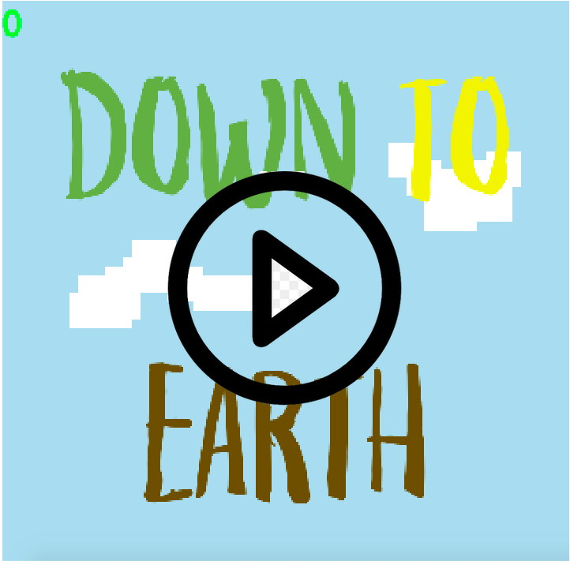

# Hey, I'm Carl 👋

Hello, I'm Carl. I'm a full stack web engineer with a passion for learning and solving problems. I primarily work with Javascript, Ruby on Rails, SQL, Redis, and Kafka. I also do a little game development on the side as a hobby! 

You can play one of my games, Down to Earth, in your browser, or [go read about how I made it on my blog](https://blog.carlfurrow.com/game-development/2019/03/05/down-to-earth-gamedev-notes.html).

